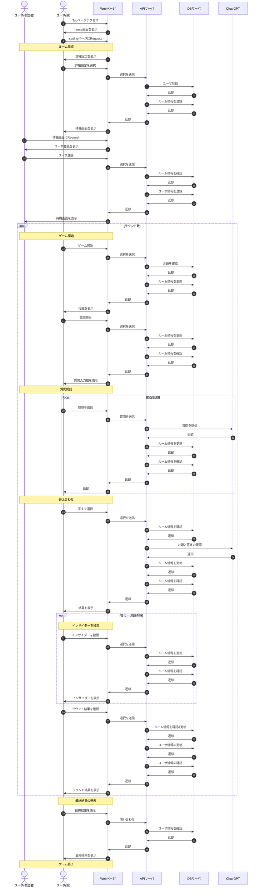

# 環境構築
## WSL(1.2.5.0)
vscodeに以下の拡張機能をインストールする  
* WSL  
* SQLite
* Python

左下の><からwslに接続を行う  
Ctrl + @ でターミナルを起動  
適当なフォルダを作成し，リポジトリをクローンする  
`git clone https://github.com/Tanakaryuki/tsumaguro-backend.git`  

フォルダに移動する  
`cd tsumaguro-backend`  

仮想環境の作成  
`python3 -m venv env`  

(仮想環境の作成に失敗した場合)  
`sudo apt install python3.xx-venv`  

仮想環境を有効化  
`. env/bin/activate`  

ライブラリをインストール  
`sudo pip install -r requirement.txt`  

(ライブラリのインストールに失敗した場合)  
`sudo apt install python3-pip`  

 

# 開発の開始  
FastAPIの起動  
`uvicorn main:app --reload`  

ブラウザで[http://localhost:8000](http://localhost:8000)を開く  

 

# デバッグについて  
SQLiteの閲覧  
vscode上で  
`Ctrl + Shift + p`  
`SQLite: Open Database`  

APIのテスト(バックエンド向け)  
[http://localhost:8000/docs](http://localhost:8000/docs)から行う  

APIドキュメントの確認(フロントエンド向け)  
[http://localhost:8000/redoc](http://localhost:8000/redoc)から行う  

 

# 開発の終了  
FastAPIの停止  
`Ctrl + c`  

仮想環境の無効化  
`deactivate`  

# インサイダーゲームについて  
## ルール  
1. プレイヤーは「市民」と「インサイダー」に分けられる(インサイダーのみ答えを知っている)  
2. 各プレイヤーはターン毎にChatGPTに質問をする  
3. 質問を終えるとみんなで話し合い答えを決定する  
4. もし答えが合わなかったら全員負けになる  
5. 答えが合ったらインサイダーを投票する  
6. インサイダーを当てた場合「市民」に1点，インサイダーを外した場合「インサイダー」に2点が入る  
7. 全ラウンド終了後に一番点数が高いプレイヤーが勝利  

# アプリ概要  

# 画面遷移  
* home(/)  
ルール説明とルーム作成  

* ルーム作成(/setting)  
ユーザ名，部屋名，プレイヤー人数，質問回数，ラウンド数を設定

* ルーム入室(/{room_id})  
ユーザ名を登録  

* 参加者待機(/waiting/{room_id}?id={user_id})  
現在の参加者を表示  

* 役職配布(/position/{room_id}?id={user_id})  
インサイダーにお題を公開  

* 質問(/questioning/{room_id}?id={user_id})  
テキストボックスに質問を入力(みんなの質問が揃うまで進行無し)  

* 答え合わせ(/answering/{room_id}?id={user_id})  
お題と答えが一致するか表示  

* インサイダー投票(/voting/{room_id}?id={user_id})  
誰がインサイダーか投票(お題を間違えた場合表示されない)  

* インサイダー投票結果(/voting_result/{room_id}?id={user_id})  
誰がインサイダーか表示(お題を間違えた場合表示されない)  

* ラウンド結果(/round_result/{room_id}?id={user_id})  
ラウンドの結果を表示  

* 最終結果(/final_result/{room_id}?id={user_id})   
全ての得点を表示

役職配布からラウンド結果までは一つにまとめても良い  

# ゲームステータス  
0: プレイヤー待機  
1: 役職配布  
2: 質問  
3: お題確認  
4: インサイダー投票  
5: インサイダー結果  
6: ラウンド結果  
7: 次のラウンドへ  
8: 最終結果